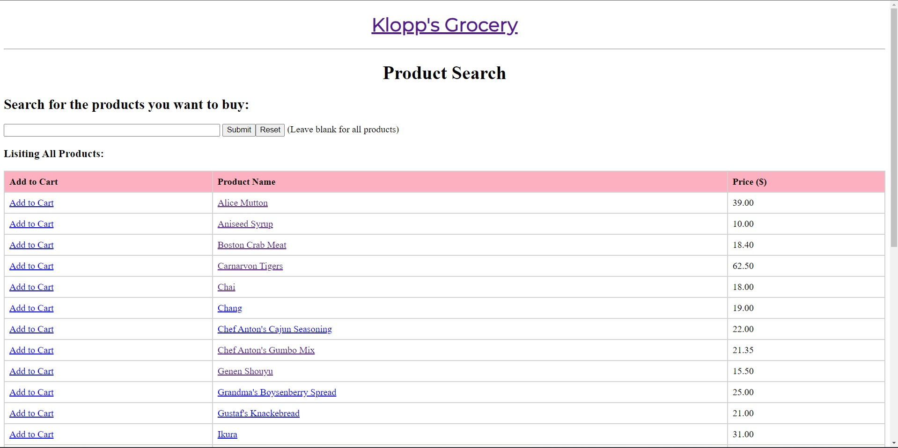
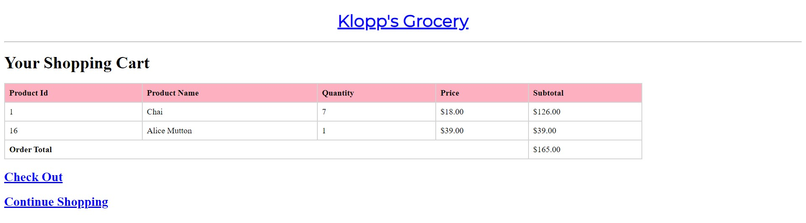

# Klopp's Grocery Store

Welcome to Klopp's Grocery Store, a **Java-based full-stack project** that harnesses the power of MySQL, Docker, and JDBC to create an innovative online grocery shop!

You can:

- Search for Items
- Add items to Cart
- View your Cart
- Log in to Checkout
- Check Order History
- More cool stuff!

## A Glimpse of Our Pages

## About the Creators
[Ojus Sharma](https://github.com/ojusharma) /
[Sparsh Khanna](https://github.com/Sparshkhannaa)
 
Computer Science Major - Data Minor - University of British Columbia, Okanagan

## Our Goals

Our primary goal is to provide a user-friendly and efficient online shopping experience for groceries. We strive to offer a diverse range of products, smooth navigation, secure transactions, and responsive customer service. Our aim is to make grocery shopping convenient and enjoyable for everyone.
